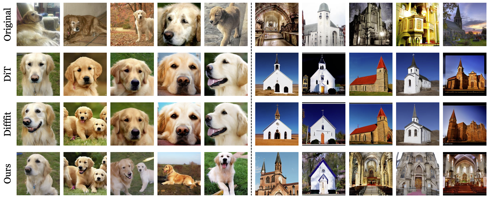
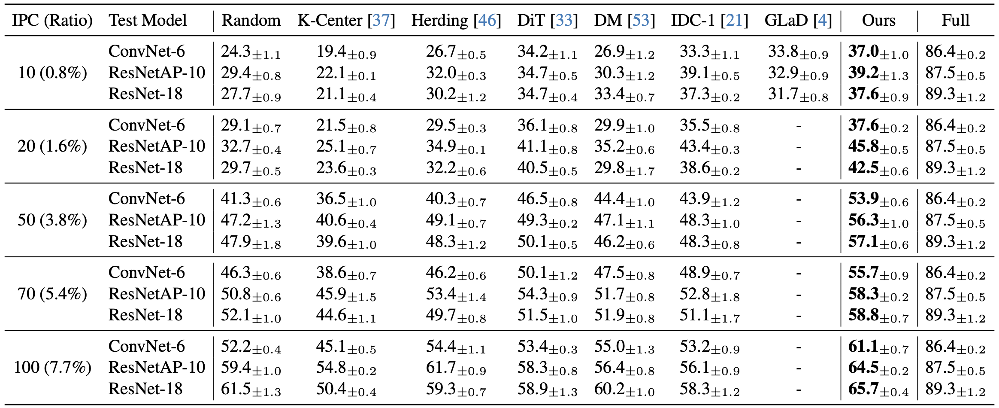
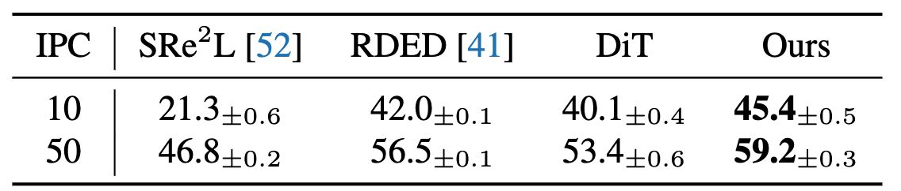

# Efficient Dataset Distillation via Minimax Diffusion

Official implementation of "[Efficient Dataset Distillation via Minimax Diffusion](https://arxiv.org/abs/2311.15529)".

<p align="center"></p>

## News
- MinimaxDiffusion is accepted by CVPR2024!
- We extend MinimaxDiffusion to the full ImageNet-1K dataset and achieves state-of-the-art results!

## Highlights :sparkles:
- MinimaxDiffusion only requires 1 hour to finish the distillation process of a 10-class ImageNet subset, including the fine-tuning and image generation processes. 
- The efficient design of MinimaxDiffusion makes it possible to conduct practical distillation for surrogate datasets with larger IPC and resolution. 
- MinimaxDiffusion achieves state-of-the-art performance on multiple ImageNet subsets. Especially on the fine-grained ImageWoof, it surpasses second-best DD method by 8.1% under the 100-IPC setting. 

## Getting Started

Download the repo:
```bash
git clone https://github.com/vimar-gu/MinimaxDiffusion.git
cd MinimaxDiffusion
```

Set up the environment:
```bash
conda create -n diff python=3.8
conda activate diff
pip install -r requirements.txt
```

Prepare the pre-trained DiT model:
```bash
python download.py
```

## Running Commands

You can simply run the prepared `run.sh` to reproduce the ImageWoof experiment in the paper. 
```bash
sh run.sh
```

It contains the following steps:

### Model fine-tuning

```bash
torchrun --nnode=1 --master_port=25678 train_dit.py --model DiT-XL/2 \
     --data-path /data/datasets/ImageNet/train/ --ckpt pretrained_models/DiT-XL-2-256x256.pt \
     --global-batch-size 8 --tag minimax --ckpt-every 12000 --log-every 1500 --epochs 8 \
     --condense --finetune-ipc -1 --results-dir ../logs/run-0 --spec woof
```

### Image generation

```bash
python sample.py --model DiT-XL/2 --image-size 256 --ckpt ../logs/run-0/000-DiT-XL-2-minimax/checkpoints/0012000.pt \
    --save-dir ../results/dit-distillation/imagenet-10-1000-minimax --spec woof
```

### Validation

```bash
python train.py -d imagenet --imagenet_dir ../results/dit-distillation/imagenet-10-1000-minimax /data/datasets/ImageNet/ \
    -n resnet_ap --nclass 10 --norm_type instance --ipc 100 --tag test --slct_type random --spec woof
```

There are two directories in the validation command. The first one refers to the data for training, while the second one for testing. If you want to validate the performance of original data, run:

```bash
python train.py -d imagenet --imagenet_dir /data/datasets/ImageNet/ \
    -n resnet_ap --nclass 10 --norm_type instance --ipc 100 --tag test --slct_type random --spec woof
```

## Results

Performance comparison with state-of-the-art methods on ImageWoof. 
We provide example generated images [here](https://drive.google.com/file/d/1oVool9rNOHmr7acZAeH9vERW64ZfqkG8) to reproduce the results. 
<p align="center"></p>

We further extend MinimaxDiffusion to the full ImageNet-1K dataset. The generated 50-IPC images can be found in [google drive](https://drive.google.com/file/d/1HYZOiSEzJed67D_UTZEI2JElrsA6AM9n). With a better validation protocol provided in [RDED](https://github.com/LINs-lab/RDED) the generated data achieves the following accuracy:
<p align="center"></p>

## Acknowledgement
This project is mainly developed based on the following works:
- [DiT](https://github.com/facebookresearch/DiT)
- [Difffit](https://arxiv.org/abs/2304.06648)
- [DiffFit-pytorch](https://github.com/mkshing/DiffFit-pytorch)
- [IDC](https://github.com/snu-mllab/efficient-dataset-condensation)

## Citation
If you find this work helpful, please cite:
```
@inproceedings{gu2024efficient,
  title={Efficient Dataset Distillation via Minimax Diffusion},
  author={Gu, Jianyang and Vahidian, Saeed and Kungurtsev, Vyacheslav and Wang, Haonan and Jiang, Wei and You, Yang and Chen, Yiran},
  booktitle={Proceedings of the IEEE/CVF Conference on Computer Vision and Pattern Recognition (CVPR)},
  year={2024}
}
```
